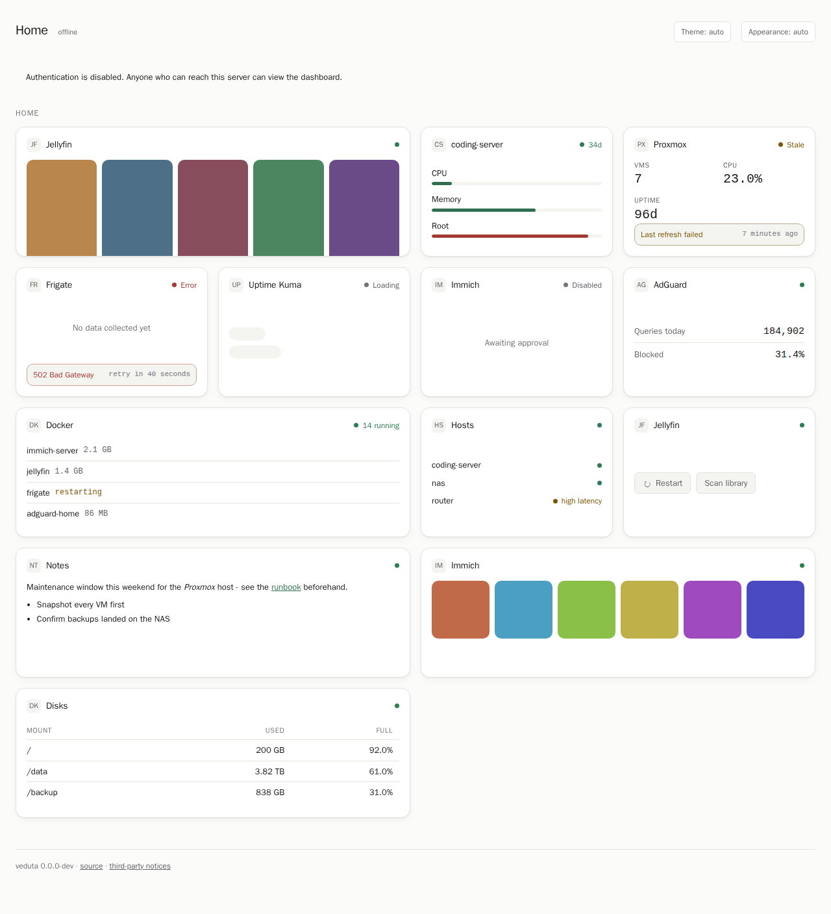

# Veduta

> *veduta* (n.) — a highly detailed, wide-angle painting of a place.

Veduta is an experimental, self-hosted dashboard for homes and homelabs. It is being built to
present service and machine data—including photos, posters, and other rich content—through a
small, consistent interface.

Its central design idea is that integrations should not need unrestricted access to the host or
to service credentials. Integrations declare the operations they need; Veduta's core owns the
credentials and applies the approved capability and route limits.

> [!WARNING]
> **Veduta is early software, and `v0.1.0` is a pre-release.** Pre-1.0 carries no stability
> promise: configuration, storage, APIs, packaging, and the plugin ABI may change between releases
> without a migration path. Action controls render and are permanently disabled — executing them is
> not implemented. Treat it as something to evaluate, not as a dashboard to depend on.



*A test fixture, not a released product. The image is maintained by the visual-regression suite.*

## Why Veduta?

Existing self-hosted dashboards already do an excellent job of providing links, service widgets,
monitoring views, and visual customisation. They are also established products, while Veduta is
not. Veduta exists to explore a narrower extension contract: an integration returns typed content
from a fixed rendering vocabulary, cannot render arbitrary code in the dashboard, and reaches an
upstream service only through capabilities and routes approved by the operator.

That trade-off aims to make rich, third-party integrations easier to reason about, at the cost of
less freedom than arbitrary templates or frontend components. See
[Why Veduta, and how it differs](docs/why-veduta.md) for the rationale, a comparison with Homepage,
Glance, Homarr, and Dashy, and the important maturity caveat.

## What is here today

The repository contains a working development implementation of the dashboard, configuration
loader, integration runtimes, capability broker, authentication, persistence, notifications, and
packaging automation. These components have automated tests, but their presence does not imply
release readiness or interface stability.

Action blocks are currently display-only and remain disabled. Executing approved actions needs a
separate design and implementation; it is tracked in the
[backlog](docs/03-backlog.md#action-execution-is-not-implemented).

Detailed engineering progress and remaining work live outside this README:

- [Implementation plan and alpha preparation](docs/02-implementation-plan.md)
- [Open gaps and decisions](docs/03-backlog.md)
- [Architecture and security boundaries](docs/01-architecture.md)
- [Design research and product scope](docs/00-review-and-prior-art.md)
- [Product rationale and dashboard comparison](docs/why-veduta.md)
- [Theming and visual-customisation decision](docs/decisions/0002-theming-and-visual-customisation.md)
- [Why cards are not extensible with JS, CSS, Mermaid or Adaptive Cards](docs/decisions/0004-card-expressiveness-and-the-presentation-contract.md)

## Quick start

`latest` is deliberately not published before 1.0, so a deployment names the version it wants.
Three steps, and the only prerequisite is Docker:

**1. Generate a password hash.** Veduta stores an Argon2id verifier, never a password. The command
reads the password from stdin — never from an argument, which would leave it in your shell history
— so type it and press Ctrl-D:

```sh
mkdir -p config && docker run --rm -i ghcr.io/sergeyfarin/veduta:0.1.0 auth hash
```

**2. Write `config/veduta.yaml`,** pasting that hash in. Both settings shown are mandatory: the
container must bind its own interface, and Veduta refuses to start on a non-loopback address
without authentication configured.

```yaml
version: 1
server:
  listen: "0.0.0.0:8099"
  dataDir: /data
auth:
  mode: password
  admin:
    username: admin
    passwordHash: "$argon2id$v=19$m=65536,t=3,p=4$...paste yours here..."
dashboard:
  title: Home
```

**3. Write `compose.yaml` and start it.**

```yaml
name: veduta
services:
  veduta:
    image: ghcr.io/sergeyfarin/veduta:0.1.0
    restart: unless-stopped
    ports:
      - "127.0.0.1:8099:8099"
    volumes:
      - ./config:/config
      - veduta-data:/data
    read_only: true
    cap_drop: [ALL]
    security_opt: ["no-new-privileges:true"]
volumes:
  veduta-data:
```

```sh
docker compose up -d
```

Veduta is now on <http://127.0.0.1:8099>. The dashboard is empty until you add connections and
cards — [`examples/veduta.yaml`](examples/veduta.yaml) is a worked configuration to borrow from,
and the [setup guide](docs/getting-started.md) walks through connecting a real service.

Two things that quick start decided for you, both covered in the [Docker notes](docs/docker.md):

- **The port is published to loopback only.** Veduta speaks plain HTTP and its session cookie
  carries no `Secure` attribute, so reaching it from elsewhere on your network means putting a
  TLS-terminating reverse proxy in front. Changing it to `8099:8099` for a throwaway test on a
  trusted LAN is a deliberate downgrade, not a default.
- **The hash sits in `veduta.yaml`.** That is fine for a verifier, but real service credentials
  should not follow it there — `${secret:NAME}` reads them from Docker secrets instead, which
  [docs/docker.md](docs/docker.md#keeping-credentials-out-of-the-config-file) shows how to add.

To see the dashboard before configuring anything, the checked-in fixture showcase needs no
configuration file at all. It holds no credentials, so the override below is safe here and
nowhere else — the container has to bind `0.0.0.0` to be reachable from the host, and that is
exactly the bind Veduta refuses without authentication:

```sh
docker run --rm -p 127.0.0.1:8099:8099 ghcr.io/sergeyfarin/veduta:0.1.0 \
  serve --fixtures --listen 0.0.0.0:8099 --i-know-what-im-doing
```

### Other ways to install

[`compose.yaml`](compose.yaml) in this repository is the quick start's file plus a read-only Docker
socket proxy, behind a profile, for the Docker card.

Archives for `linux/amd64`, `linux/arm64`, `linux/arm/v7` and `darwin/arm64`, each carrying the
first-party integrations and the licences beside the binary, are attached to the
[release](https://github.com/sergeyfarin/veduta/releases/tag/v0.1.0) with a `SHA256SUMS` to check
them against. The toolchain for building from source is in
[docs/dev-environment.md](docs/dev-environment.md).

Useful references:

| Document | Purpose |
| --- | --- |
| [Setup and evaluation](docs/getting-started.md) | Configuration, archive layout and the fixture dashboard |
| [Configuration reference](docs/configuration.md) | Generated reference for the current, unstable configuration schema |
| [Integrations](docs/integrations.md) | Current first-party integration coverage and requirements |
| [Integration authoring](docs/integration-authoring.md) | Experimental declarative and Rust/WASM extension interfaces |
| [Security model](docs/security.md) | Trust boundaries, deployment assumptions, and operator checklist |
| [Docker notes](docs/docker.md) | Container layout, hardening and the Docker connection |
| [Migration notes](docs/migration.md) | Current import and upgrade design; not a compatibility guarantee |
| [Contributing](CONTRIBUTING.md) | Contribution and verification requirements |

## License

The core is licensed under AGPL-3.0-or-later. `sdk/`, `schemas/`, and first-party integrations are
licensed under Apache-2.0, with a plugin exception that allows community integrations to use other
licences. See [LICENSING.md](LICENSING.md) and
[THIRD-PARTY-NOTICES.md](THIRD-PARTY-NOTICES.md).
