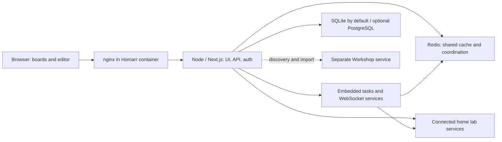

# Homarr v2: architecture, feedback, and where Veduta should compete

Research snapshot: **2026-10-09**. This extends the [product direction review](product-direction.md).
Homarr source was inspected at **v2.3.0, `e8d67b9b02152ec7ebc7f944cfc3ae47b59c2331`**;
public docs, issues, PR status and community discussions were checked separately. Source inspection
does not constitute a security audit or a runtime benchmark. No Homarr deployment, upstream
contribution, or migration was performed during this review.

## The revised judgment

**Extending Homarr is the best first experiment for getting a capable personal dashboard quickly.
Contributing to Homarr is promising for bounded improvements that fit its direction. Continuing
Veduta makes sense if the goal is a materially different experience or operating model.**

The strongest independent Veduta thesis is a deliberately small, readable home-and-lab overview
with dependable background observation, useful incident history, and reviewable configuration.
That requires demonstrating a benefit beyond a stylish set of widgets. Building a smaller Homarr
with fewer integrations would be expensive and weakly differentiated.

There is room between abandoning Veduta and competing with all of Homarr. Use Homarr to expose
real needs, contribute a small improvement, and preserve Veduta as the place to test one different
workflow. Only choose a permanent architecture after that experiment. Do not turn this into two
indefinite production development tracks.

## Homarr's approach

Homarr v2 is evolving from a configurable landing page into **a service-access platform with a
dashboard, authoring tools, and agent interfaces**. That is an inference from shipped interfaces,
not an announced promise about a future release. Its official [v2 announcement][announcement]
emphasises custom widgets, Workshop, a rebuilt editor, shared integrations and broader controls.

Its product loop is: connect a service once, reuse that connection in built-in widgets, custom
widgets and permitted API/agent requests, then arrange the result in boards appropriate to the
viewer. The [Assistant][assistant] can use that same authority on behalf of its signed-in user;
changes require approval by default. Assistant is optional, so disliking chat inside a dashboard
does not by itself rule out Homarr.

Veduta's loop is narrower: define connections and cards in files, review an integration's requested
authority, schedule its operation, and display a resolved typed document. The host owns the
presentation and execution state. These approaches overlap in capabilities but optimise different
things: Homarr makes varied interactions and authoring accessible; Veduta can optimise a compact,
predictable read experience and file-based operation.

## Architecture: what actually runs

The pinned [Dockerfile][dockerfile], [startup script][startup], [production instrumentation][instrumentation]
and [workspace manifest][workspace] establish this shape:

This is a simplified responsibility diagram, not a complete call graph. The standard deployment
is **one container**, but internally several runtime components. Production embeds tasks and the
WebSocket service in the Node application; development can run them separately. Redis and nginx
are included in the standard image, with an external-Redis option. It is inaccurate to describe
Homarr as requiring the operator to run a large cluster just because its repository is a monorepo.
It is equally inaccurate to treat one container as equivalent to Veduta's one Go executable.

| Layer | Homarr v2.3.0 | Effect on the decision |
| --- | --- | --- |
| Application | TypeScript monorepo; React/Next.js, Mantine UI, TanStack Query, tRPC; Bun for workspace installation/scripts, Node for the deployed app | A larger contribution surface, but existing UI, auth and admin capabilities can save substantial work |
| Configuration | Boards, layouts, integrations, users and widget definitions live in the database | Natural browser editing; programmatic configuration is possible, but does not make files the authoritative store |
| Persistence | Drizzle-backed SQLite by default and PostgreSQL support; encrypted secret records | More migration and schema responsibilities than Veduta's runtime-only SQLite model |
| Live data | Typed widget request handlers, process/shared caches, request deduplication, WebSockets and scheduled tasks | Already has freshness and load-management machinery; do not assume it is merely static tiles |
| Extensions | Custom definition + named requests + restricted JSX; native integrations/widgets are source contributions | Most simple API/UI additions need no fork; deeper runtime features still need core changes |
| Distribution | Workshop is a separate service that supplies installable definitions | Useful community discovery without building Veduta's own marketplace; imported definitions execute through local Homarr boundaries |

The source [request handler][request-handler] and [shared cache][shared-cache] include bounded
admission, deadlines, refresh locks and stale-on-error behavior. Complexity here solves genuine
multi-widget/multi-viewer problems. Removing Redis or replacing Next.js is not a small contributor
task and would work against the current architecture. If those dependencies themselves violate
your deployment goals, an independent small app is a better fit than a permanent Homarr fork.

### Layout is a meaningful product difference

Homarr stores explicit positions and sizes for separate breakpoint layouts. It uses fixed logical
geometry and scales the canvas to the viewport; Containers provide grouping and rails provide
sidebars. The pinned [layout design][layout-source] describes the geometry, collision handling,
reading order and coordinate conversion. Current [board documentation][boards] explains independent
mobile/base layouts and whole-board scaling.

This offers precise control, but makes density, migration and narrow screens harder. It is
different from a naturally flowing grid whose cards reflow and use container queries internally.
Veduta already leans toward the latter. A readable phone page requiring little per-device layout
maintenance could be a worthwhile distinction. It must be proved with real content: Veduta's own
[#20](https://github.com/sergeyfarin/veduta/issues/20) and
[#24](https://github.com/sergeyfarin/veduta/issues/24) show that a simpler layout model does not
automatically deliver a finished experience.

### Custom widgets are a substantial extension surface

Homarr's custom-widget package separates schemas, JSX analysis/interpreting, runtime components,
server execution and authoring resources. It is not arbitrary React code executed with access to
the browser. A definition names sources, requests, typed options and a template. The
[restricted runtime][jsx] supports safe components and bounded expressions, local inputs,
manual reads and explicit action components.

The [executor source][executor] and [network policy][network-policy] implement credential-mediated
requests, origin/path checks, DNS validation/pinning, reserved-header restrictions, byte limits,
deadlines and redirect policy. The richer interaction model is real: forms and selected-row
parameters are possible where Veduta currently supplies resolved documents and no executable
actions. That flexibility is useful for unusual services and introduces more semantics for the
host to validate and maintain.

Two details prevent an oversimplified security comparison:

- Homarr's network scopes are a **hierarchy of permitted destinations** in the inspected source:
  private permits public destinations too; loopback permits those plus loopback. They are not
  disjoint source compartments. Veduta's proposed internet/LAN separation is not implemented
  either. Labels alone do not prevent every mixed-source disclosure.
- Homarr has [definition-state fingerprints and transactional updates][definition-update], plus
  [tested-preview persistence paths][creation]. These protect stale edits and bind preview
  evidence to saved revisions. They should not be dismissed as “no review” because Homarr lacks
  Veduta's particular lock-file workflow. Conversely, preview/edit concurrency protection is not
  the same contract as independent manifest/connection/operator route grants.

Homarr also checks board and integration permissions, with generic saved-integration requests
requiring full integration access. Veduta's narrower grants are a specific alternative; Veduta
does not yet supply comparable per-viewer household permissions. This review establishes
different models, not a finding that either product is more secure overall.

### Continuous observation, cached snapshots, and history are different

The pinned [Custom API component][custom-component] periodically calls its data query from a
mounted browser widget. No custom-widget polling job was found in the inspected tasks/cron
registration. This does **not** mean all Homarr integrations stop when browsers close; several
features have background jobs. It means a custom widget is not, by itself, a demonstrated
always-running incident collector.

Statistics also deserves care. Its [snapshot handler][stats-handler] stores values, timestamps and
error/stale state; its [API][stats-api] distinguishes reading a saved snapshot from refreshing the
upstream. The browser can poll snapshots without that constituting continuous upstream monitoring.
Therefore a statistics card, a live custom widget, and an overnight incident log are different
capabilities. Do not mistake a successful dashboard fetch for fresh measurements from every source.

Veduta already schedules configured cards when nobody is viewing them and persists rule
transitions, but its consolidated Activity card remains unbuilt. A durable record that explains
what opened, what recovered, and what was never observed is still an experiment worth testing.
It could use existing upstream monitor history, a Homarr core job, or a separate service. There is
no reason to assume it needs an entirely new dashboard frontend.

## Public direction and roadmap: separate evidence from inference

No dated post-v2 product roadmap was established from the inspected public sources. The
[milestone snapshot][milestones] still had a v2.0 milestone with no due date and no open items.
That is a weak planning artefact, not evidence that development stopped. Public PRs, shipped
releases and maintainer responses provide more concrete signals.

| Evidence as of October 9 | Status | What it says, and what it does not |
| --- | --- | --- |
| Custom Widgets, Workshop, Assistant/MCP and rebuilt boards | Shipped v2 direction | Homarr is investing in reusable service access and authoring. These are not speculative Veduta differentiators. |
| [Expanded existing API controls, #6546][api-pr] | Merged October 7; included in v2.3.0 | Declarative tooling is becoming more feasible. It does not establish complete REST coverage, a stable file-based desired-state format, or all bootstrap operations. |
| [Container reflow, #7096][reflow-pr] | Open PR | Direct attention to narrow-layout problems. It is not yet a shipped fix in the pinned release. |
| [Automatic layout, #4549][auto-layout-pr] | Open draft, labelled post-v2 | Automatic placement has interest, but no delivery date or acceptance commitment was established. Do not build a competing redesign without discussing this work. |
| [Memory work, #6537][memory-pr] | Open, labelled blocked/post-v2 | Resource use is an acknowledged engineering target. Its branch benchmark claims are not numbers for the released v2.3.0 image. |
| [Mobile editing, #7023][touch-issue] | Open, good-first-issue label | A focused contribution opportunity aligned with a reported need. |
| [Denser grid increments, #7053][density-issue] | Open request awaiting triage | Users want less wasted space; this is a request, not a roadmap commitment. |

**Inference:** near-term work will likely continue around stabilisation, widget/service coverage,
layout usability, resource use and agent/API authoring. Confidence is higher about the existing
platform direction than about the timing or acceptance of any specific proposal. A dashboard,
editor and agent interface sharing one authority model is strategically coherent, but grows the
test and maintenance surface.

File-oriented configuration is also less exclusive than the earlier comparison might suggest.
The pinned [OpenAPI schema][openapi] exposes board settings read/write, content replacement and
layout controls. Current [API docs][api-docs] explain that complete-content replacement removes
omitted items and that reading current content still uses tRPC. A Git-managed synchroniser is
plausible; safe round-tripping, preservation of unmanaged GUI edits, stable identifiers and read
coverage remain work to validate. Do not promise Terraform/GitOps parity merely because a write
endpoint exists, or describe Homarr as fundamentally impossible to automate.

## What users say about v2

The v2 release is only a week old in this snapshot. This is a **purposive sample** of launch
threads, concrete reports and their follow-up, not a survey. Popular posts do not measure retention.
Launch announcements include maintainer promotion; bug trackers over-sample problems; some
reports were written with AI assistance. Cross-posted announcements and a person's Reddit/GitHub
reports are not independent users. The positive and negative accounts below are deliberately
kept together.

| Source / period | Reported experience | Interpretation and status |
| --- | --- | --- |
| [Homelab launch discussion][launch-homelab], October 2–4 | Interest in custom widgets, renewed trials, questions about RAM and migration; maintainer describes memory improvements and higher interactive server work | Genuine interest, not evidence of sustained use. Maintainer figures are claims about their workloads, not a benchmark against Veduta. |
| [Selfhosted launch discussion][launch-selfhosted], October 2–8 | Appreciation of label compatibility; questions about permission increases and resource use; maintainer describes a practical use for Assistant | People value reuse and integration convenience. The privilege question is useful feedback but the reply does not prove a digest-bound update policy. |
| [Positive migration from CasaOS][casaos-feedback], October 8–9 | A v2 user praises mobile use and separate mobile boards; another asks for finer widget filtering | V2 can substantially improve the experience for some users. The comparison baseline is CasaOS, not Veduta or a controlled multi-product test. |
| [“Version 2 good, but update not perfect”][migration-feedback], October 2–8 | Smaller migrated layout, position loss and rollback difficulty; a later commenter reports sluggishness and failing checks | The author corrected a board-switching complaint as their own misunderstanding. Position restoration and migration guidance were addressed; not every original complaint remains current. |
| [Layout loss #6973][layout-loss] and [migration docs #6975][migration-docs] | Detailed follow-up including testing a fix against a fresh migration | Closed after fixes shipped in v2.1.0. Previously lost positions still needed repair. These are the same migration author's reports, not additional independent evidence. |
| [Mobile Container reflow #7094][mobile-reflow], October 8 | On v2.3.0, collapse/expand can leave gaps or overlap neighbours in a migrated small layout | Open with visual evidence; the related PR remains open. It is a specific reproducible-looking report, not a verdict on every mobile board. |
| [512 MiB-limit OOM #6982][oom-issue], October 3 | v2.0.0 crashed during ordinary navigation under that container limit; reporter says a larger limit avoided it | Open; version and memory limit matter. Do not generalise it into a universal v2.3.0 leak or a minimum supported RAM specification. |

The most useful conclusion is not “v2 is good” or “v2 is bad.” It is that a clean v2 trial must
test the actual density, phone interactions, resource limits and upgrade/restore workflow. An
existing migrated instance and a clean install answer different questions. Rapid fixes are
encouraging; the ongoing reports justify testing rather than relying on the demo.

### Wider dashboard feedback changes what to build

| Pattern in user feedback | Evidence and caveat | Product consequence |
| --- | --- | --- |
| YAML is either a benefit or a barrier | [October 2025 dashboard preferences][preferences] includes users valuing copy/paste configuration and others preferring GUI setup; [June 2026 alternatives][alternatives] asks for a sleek UI without writing config | There is no universal “best configuration.” Veduta can serve file-oriented operators, but guided authoring should not require everyone to learn its DSL. |
| A lighter page can be worth configuration effort | [February 2026 Glance migration][glance-feedback] reports satisfaction with presentation and perceived resource savings, alongside live-refresh complaints | This predates Homarr v2. Treat reported RAM values as deployment-specific. Small, fast and pleasant still matters; live updates alone are not sufficient. |
| Keeping the page current matters more than initial setup | [Dashboard suggestions][suggestions] includes a user whose other dashboards became outdated, and a user preferring browser autocomplete over any dashboard | Maintenance reduction and a task the browser cannot already do are stronger goals than adding widgets. |
| Some people want fewer tools | [“Zero maintenance” discussion][zero-maintenance] includes an owner retaining Beszel and Kuma while dropping the complex homepage, and others suggesting HA or bookmarks | A dashboard must justify being another service. A static launcher or no new dashboard is a valid outcome. |
| Live updates can increase upstream work unexpectedly | [Dynacat refresh account][dynacat-feedback] reports repeated calls through an n8n/cloud workflow from a tab left running | This is a reported configuration experience, not a verified billing or cache defect. Separate UI refresh from expensive upstream observation and respect explicit source budgets. |

One additional comparator matters: [Dynacat][dynacat], a Glance fork, documents a browser editor
that writes the same YAML users can edit by hand, plus dynamic updates. It directly challenges the
idea that Veduta could differentiate simply by combining a small Go dashboard, YAML and a GUI.
Its security boundaries, file preservation and production behavior were not audited here; it is
a useful trial candidate and a design precedent, not a recommendation to migrate blindly.

The recurring opening is **less maintenance, better density, honest freshness and fewer manual
checks**. None of those is owned by a particular framework. A quiet app that surfaces one useful
exception can be more valuable than a large screen of continuously changing counters.

## Extending, contributing, or building Veduta: decide by the job

| The actual job | Best first route | Why | What would change the answer |
| --- | --- | --- | --- |
| A good personal page with media, sensors, controls and several viewers | Homarr configuration plus one small custom widget | Most infrastructure and visible features already exist | Repeatedly poor density/readability or an unacceptable measured footprint on the intended host |
| A missing UI or native service capability that many Homarr users need | Focused upstream contribution | Reuses users, permissions, releases and integration clients | Maintainers reject the direction or the change requires a persistent architectural fork |
| Reviewable files and unattended deployment | Test a Homarr desired-state/API contribution alongside Veduta | API coverage is improving; GitOps need not require a second dashboard | Full round-trip/ownership semantics remain awkward, or local files as source of truth are a firm requirement |
| A small page that reads well automatically on phones and modest hardware | Fix Veduta's current UI and compare it with Homarr and Dynacat | Different layout and runtime choices can support a real niche | The alternatives meet the task with less upkeep; a performance advantage is not measured |
| A trustworthy history of selected events while nobody watches | Existing monitor/HA records first, then a small journal experiment | The distinctive problem is durable selection and lifecycle, not drawing another grid | Existing source histories already answer the questions, or testers find the journal mostly noise |
| Learning, aesthetic ownership and enjoyment | Keep a deliberately bounded personal Veduta | Personal satisfaction is a valid return | The project starts consuming the time intended for operating or enjoying the home lab |

“Better Veduta” needs an explicit definition. A concrete one is: less setup and ongoing work,
readable phone layout without manual rearrangement, clear provenance/freshness, useful discoveries
across services, and an operating budget demonstrated on a modest host. It does not have to mean
more integrations, more customisation, or more AI tools than Homarr.

### Contributions with a plausible payoff

1. **Validate and improve a narrow mobile interaction.** Reproduce one task from #7023, such as
   moving/resizing with touch without scrolling the page, and use keyboard/numeric controls as
   a reference. Avoid a competing grid rewrite; #7096 and #4549 already cover related work.
   Offering a reproducible test of an existing PR may be more useful than adding another PR.
2. **Complete one desired-state round-trip.** Build a small proof around reading and applying
   board settings/content with stable identifiers, then fix the specific missing supported read
   or update operation. Specify how GUI changes are preserved and conflicts detected. Do not
   begin with a universal Terraform provider or direct database mutation.
3. **Contribute workload evidence for constrained hosts.** Test the released image and the
   relevant performance PR with the same restored, redacted scenario. Cover peak memory and
   interactions, not only idle RAM. A useful finding can become a small resource fix or precise
   operating guidance; #6537 already supplies a serious measurement direction to learn from.
4. **Publish one polished workflow widget.** Backup freshness or a selected household exception
   is more informative than an arbitrary counter demo. Include unavailable, stale, empty and
   small-width states, and measure required permissions. Learn whether maintaining a widget is
   cheaper than maintaining a complete dashboard before scaling the catalogue.

The [developer guide][development] describes a Node/Bun/Docker setup and focused validation.
Native features span typed definitions, lazy loaders, API/request handlers and UI; the
[widget/integration guide][native-guide] maps those seams. Custom definitions are therefore the
lowest-cost contribution layer. They cannot install an arbitrary server-side collector or a
new database lifecycle: those require native changes or a separate service.

The pinned [PR template][pr-template] expects the intended branch, conventional commits,
relevant validation and real-service/offline smoke checks for integrations. Offering feature
maintenance is encouraged. Upstream contribution trades whole-app ownership for coordination
and ownership of your slice; it does not guarantee somebody else will maintain your feature.
Before spending a large amount of implementation time, establish agreement through the relevant
existing discussion. This review did not contact maintainers or submit upstream changes.

### What Veduta should learn without becoming Homarr

| Lesson | Small Veduta application | Keep the scope bounded |
| --- | --- | --- |
| Connect a service once and reuse it | A setup recipe/picker creates one connection and several useful cards | Keep secret references and explicit approval; avoid duplicate credential fields per card |
| Test what the author is about to install | Schema-derived options, fixture preview, bounded connection test and readable request diagnostics | Emit the existing YAML/Widget Document; no new JSX runtime or frontend expression language |
| Progressive detail | A compact summary/group with an accessible way to see the full error or open the owning service | Do not make hover/keyboard modifiers the only way to discover important information |
| Tolerate partial failures visibly | Healthy neighbours remain useful while one card is stale or failing | Do not hide failures behind an aggregate green summary |
| Separate board loading from slow upstream work | Use persisted state for fast first paint and update cards independently | Preserve server observation needed by rules; viewport optimisation must not silently stop alerts |
| Validate changes against real usage | Run a configured instance through edits, reloads, outage/recovery and representative upgrades | Screenshots alone do not prove wiring, freshness or persistence |
| Keep registration discoverable | Explicit integration/block seams and focused tests | A broad abstraction or marketplace adds no value before there are users who need it |

Homarr's preview workflow and source diagnostics are particularly worth learning from. They
address the human problem around the integration contract, which Veduta's technically careful
broker does not solve on its own. Borrow that experience before borrowing a richer rendering
language. The existing ADRs permit better authoring and native blocks without reopening the
closed renderer or expanding frozen WASM.

## Options outside the dashboard-versus-dashboard choice

**A durable home-lab journal with replaceable viewers.** Use existing monitoring/HA events or a
small polling backend to record selected changes and expose an authenticated read view. A Homarr
custom widget can display it; Veduta's Activity card can test the same user job initially. The
added value is lifecycle, context and selection. Start with one source and one viewer. Do not
split Veduta into a general platform before the Activity pilot proves that a journal is useful.

**A declarative Homarr management tool.** A small file describes a desired board or workflow;
the tool diffs it against Homarr and applies only managed resources through supported interfaces.
This could satisfy the strongest YAML preference while retaining Homarr's editor and users.
The hard part is ownership, full read coverage and upgrade compatibility, not serialising JSON.
The expanded API makes a proof plausible; it does not make the problem already solved.

**Scenario packs rather than another runtime.** Provide a well-tested “small lab,” “household
exceptions,” or “backup attention” setup for an existing dashboard. Ship configuration, sample
data, permission guidance and an upgrade check. A finished workflow often has more immediate
value than a tenth way to display a number. Start on one host product; a cross-dashboard compiler
should wait for actual repeat demand.

**Discovery that proposes edits rather than granting access.** For Veduta, inspect approved
inventory or service labels and generate a reviewable YAML patch with suggested cards. Keep
credential provisioning and integration approval explicit. This addresses the maintenance
complaint without allowing newly discovered software to silently obtain new service authority.
It is a later authoring feature, not permission to change the current grant model.

**A quiet exception view rather than a homepage.** Keep browser bookmarks for navigation and
Grafana/HA for detail. Veduta could become a tiny view opened only to answer “anything I missed?”
or to review a periodic factual digest. Daily engagement is not a useful target if the home lab
is healthy. Evaluate meaningful discoveries and reduced checking, including people who return
weekly, rather than maximising screen time or notification volume.

**An independently reviewable request policy.** If real operators want tighter limits than a
widget's named requests, try an offline inspection/diff tool or propose an upstream grant model
before extracting Veduta's broker as a sidecar. A second credential-owning proxy would add setup,
latency, policy ownership and failure paths. This remains a low-confidence opportunity until
someone demonstrates why existing Homarr permissions or upstream service scopes are insufficient.

**No separate dashboard.** If the real job is opening known URLs and noticing failures,
bookmarks plus existing notifications may already win. That frees effort for an actual missing
workflow or for small contributions. Preserving Veduta's research and code does not oblige its
owner to make it a daily dependency.

## A bounded next experiment

Keep the previous six-job comparison, but extend it to expose architectural differences:

| Stage | Deliverable | Proposed cap / decision |
| --- | --- | --- |
| Baseline | Name the original v1 frustrations and define readable density, acceptable upkeep and operating budget on the intended host | Half a day; choose criteria before testing |
| Working alternative | Current Homarr v2 board with the same services and one custom widget; include Dynacat only if YAML plus UI is the leading need | Two to three developer-days; no porting the whole Veduta catalogue |
| Real-use evidence | Phone/desktop checks, five tabs/reloads, upstream outage, closed-browser period, restart and restore; record loaded/idle resources and request counts | One week of ordinary use, with controlled drills |
| One learning slice | A small Homarr contribution/test or one Veduta usability improvement that the trial identified | One to two developer-days, then reassess rather than extending the cap |
| Decision | Extend Homarr, maintain focused Veduta, or run the existing capped Activity test | Record evidence and costs; do not run two indefinite roadmaps |

For resource comparisons, record version/image, host, workload, architecture, cold/warm state,
container memory limit, server RSS/cgroup anonymous memory, browser memory, CPU and upstream
requests. These measure different things; a single idle `docker stats` number cannot answer the
decision. Use the same upstream sources and refresh policy. Do not count open-PR optimisation
results as performance of a released product, or compare Veduta's empty fixture mode with a
configured Homarr instance.

For the closed-browser drill, make one controlled source change and ask which product recorded
it, which merely displays the latest state later, and which depends on the upstream keeping its
own history. That can falsify the journal thesis cheaply. For the contribution drill, measure
setup, navigation through the code, focused validation and coordination effort. This is the
practical cost difference that feature matrices cannot show.

**Continue independent Veduta development** if its chosen experience clearly wins and users
would miss it, or if its maintenance cost is justified by personal enjoyment. **Extend/contribute
to Homarr** if its architecture fits and the gaps are local. **Pursue the journal separately**
only if it reveals useful events current tools fail to present. A failed or inconclusive test is
a reason to narrow the next experiment, not to enlarge the product until the comparison is won.

## Sources and reproducibility

Architecture links below are pinned to v2.3.0. Docs and issue/PR/community status are live and can
change. Feedback is paraphrased; no private data, real backups or service credentials were
collected. The source checkout was read without installing dependencies or running Homarr.

[announcement]: https://homarr.dev/blog/2026/09/03/homarr-2.0/
[assistant]: https://homarr.dev/docs/management/assistant/
[dockerfile]: https://github.com/homarr-labs/homarr/blob/v2.3.0/Dockerfile
[startup]: https://github.com/homarr-labs/homarr/blob/v2.3.0/scripts/run.sh
[instrumentation]: https://github.com/homarr-labs/homarr/blob/v2.3.0/apps/nextjs/src/instrumentation-node.ts
[workspace]: https://github.com/homarr-labs/homarr/blob/v2.3.0/package.json
[request-handler]: https://github.com/homarr-labs/homarr/blob/v2.3.0/packages/request-handler/src/lib/request-handler.ts
[shared-cache]: https://github.com/homarr-labs/homarr/blob/v2.3.0/packages/request-handler/src/lib/shared-cache.ts
[layout-source]: https://github.com/homarr-labs/homarr/blob/v2.3.0/apps/nextjs/src/components/board/layout/README.md
[boards]: https://homarr.dev/docs/management/boards/
[jsx]: https://homarr.dev/docs/management/custom-widgets/custom-jsx/
[executor]: https://github.com/homarr-labs/homarr/blob/v2.3.0/packages/custom-widgets/src/server/request-executor.ts
[network-policy]: https://github.com/homarr-labs/homarr/blob/v2.3.0/packages/custom-widgets/src/server/network-policy.ts
[definition-update]: https://github.com/homarr-labs/homarr/blob/v2.3.0/packages/api/src/router/custom-widget/definition-update.ts
[creation]: https://github.com/homarr-labs/homarr/blob/v2.3.0/packages/api/src/router/custom-widget/creation-procedures.ts
[custom-component]: https://github.com/homarr-labs/homarr/blob/v2.3.0/packages/widgets/src/custom-api/component.tsx
[stats-handler]: https://github.com/homarr-labs/homarr/blob/v2.3.0/packages/request-handler/src/stats.ts
[stats-api]: https://github.com/homarr-labs/homarr/blob/v2.3.0/packages/api/src/router/widgets/stats.ts
[milestones]: https://github.com/homarr-labs/homarr/milestones
[api-pr]: https://github.com/homarr-labs/homarr/pull/6546
[reflow-pr]: https://github.com/homarr-labs/homarr/pull/7096
[auto-layout-pr]: https://github.com/homarr-labs/homarr/pull/4549
[memory-pr]: https://github.com/homarr-labs/homarr/pull/6537
[touch-issue]: https://github.com/homarr-labs/homarr/issues/7023
[density-issue]: https://github.com/homarr-labs/homarr/issues/7053
[openapi]: https://github.com/homarr-labs/homarr/blob/v2.3.0/apps/docs/public/api/open-api-schema.json
[api-docs]: https://homarr.dev/docs/management/api/
[launch-homelab]: https://www.reddit.com/r/homelab/comments/1ww31ed/homarr_v2_is_out_the_frontdoor_to_your_homelab/
[launch-selfhosted]: https://www.reddit.com/r/selfhosted/comments/1ww2oeq/homarr_v2_is_out_the_frontdoor_to_your_homelab/
[casaos-feedback]: https://www.reddit.com/r/homarr/comments/1x0nlmr/moved_from_casaos_its_soooo_much_better/
[migration-feedback]: https://www.reddit.com/r/homarr/comments/1ww8nn6/version_2_good_but_update_not_perfect/
[layout-loss]: https://github.com/homarr-labs/homarr/issues/6973
[migration-docs]: https://github.com/homarr-labs/homarr/issues/6975
[mobile-reflow]: https://github.com/homarr-labs/homarr/issues/7094
[oom-issue]: https://github.com/homarr-labs/homarr/issues/6982
[preferences]: https://www.reddit.com/r/selfhosted/comments/1oirgmu/what_is_everyones_preferred_app_dashboard/
[alternatives]: https://www.reddit.com/r/selfhosted/comments/1ugtolg/homepageglance_alternatives/
[glance-feedback]: https://www.reddit.com/r/selfhosted/comments/1qvp8ka/moved_to_glance_from_homarr_and_its_incredible/
[suggestions]: https://www.reddit.com/r/selfhosted/comments/1l5izwb/suggest_me_a_dashboard_app/
[zero-maintenance]: https://www.reddit.com/r/selfhosted/comments/1qzcbef/best_zero_maintenance_start_page/
[dynacat-feedback]: https://www.reddit.com/r/selfhosted/comments/1wsureu/dynacat_dashboard_dynamic_updates_lesson_learned/
[dynacat]: https://github.com/Panonim/dynacat
[development]: https://homarr.dev/docs/advanced/development/getting-started/
[native-guide]: https://homarr.dev/docs/advanced/development/widgets-and-integrations/
[pr-template]: https://github.com/homarr-labs/homarr/blob/v2.3.0/.github/pull_request_template.md
